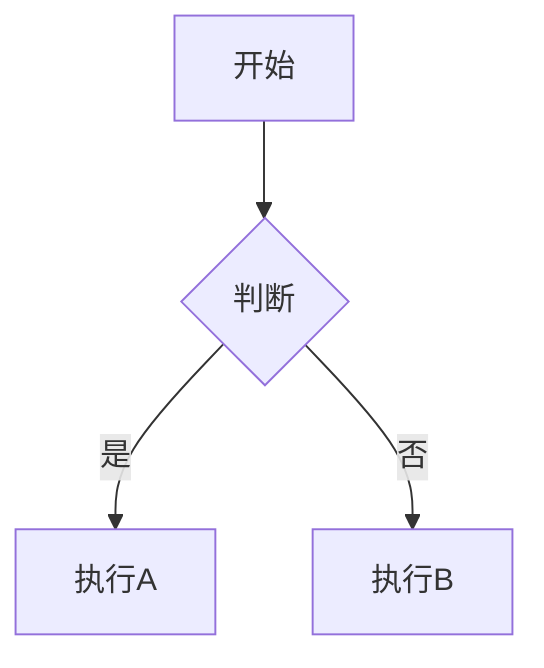

## 欢迎使用 Dumpling 主题博客！🎉

这是一篇完整的网站功能使用指南，涵盖了本博客的所有功能模块。无论你是第一次使用，还是想深入了解高级功能，这篇文章都会帮到你。

---

## 目录
1. [快速开始](#快速开始)
2. [站点基础配置](#站点基础配置)
3. [内容管理](#内容管理)
4. [侧边栏组件](#侧边栏组件)
5. [特色功能](#特色功能)
6. [Markdown 高级用法](#markdown-高级用法)
7. [配置详解](#配置详解)
8. [部署指南](#部署指南)

---

## 快速开始

### 启动开发服务器

```bash
# 进入项目目录
cd dumpling-and-cake-blog

# 安装依赖
pnpm install

# 启动开发服务器
pnpm dev
```

开发服务器将在 `http://localhost:4321` 启动。

### 项目结构

```
dumpling-and-cake-blog/
├── src/
│   ├── config/           # 配置文件目录
│   ├── content/          # 内容目录
│   │   ├── posts/        # 博客文章
│   │   ├── moments/      # 动态
│   │   ├── bangumi/      # 番组（影视、书籍、音乐、游戏）
│   │   ├── album/        # 相册
│   │   ├── daohang/      # 导航链接
│   │   ├── friends/      # 友链
│   │   ├── life/         # 生活记录
│   │   ├── changelog/    # 变更日志
│   │   ├── danmu/        # 弹幕
│   │   ├── spec/         # 特殊页面
│   │   └── ziyuan/       # 资源配置
│   ├── components/       # 组件
│   ├── pages/            # 页面
│   └── ...
└── public/               # 静态资源
```

---

## 站点基础配置

### 1. 站点基础设置 ([siteConfig.ts](file:///e:/GithubProgect/dumplingandcakeblog/dumpling-theme/src/config/siteConfig.ts))

编辑 `src/config/siteConfig.ts` 配置站点：

```typescript
export const siteConfig: SiteConfig = {
  // 站点标题
  title: "团子和蛋糕的博客",
  // 站点副标题
  subtitle: "海棠花未眠，老陈总在我身边",
  // 站点 URL（部署时需修改）
  site_url: "https://你的域名.com",
  // 站点描述（用于 SEO）
  description: "记录生活，分享技术",
  // 站点关键词
  keywords: ["博客", "生活", "技术"],
}
```

### 2. 主题色调

```typescript
themeColor: {
  hue: 230,           // 主题色色相，0-360
  fixed: false,       // 是否隐藏主题选择器
  defaultMode: "system", // 默认模式：light/dark/system
},
```

### 3. 页面宽度

```typescript
pageWidth: 100, // 页面整体宽度，单位 rem
```

### 4. Favicon 设置

```typescript
favicon: [
  {
    src: "https://re.tsh520.cn/zl/tx.webp",
  },
],
```

### 5. 页面开关

```typescript
pages: {
  sponsor: false,    // 赞助页
  guestbook: true,   // 留言板
  bangumi: false,    // 番组页
  books: true,       // 书架页
  moviesGames: true, // 影视游戏页
  musicPage: true,   // 音乐页
  changelog: true,   // 变更日志
},
```

---

## 内容管理

### 1. 博客文章 (Posts)

文章保存在 `src/content/posts/` 目录下，支持 Markdown 格式。

**创建新文章：**

```markdown
---
title: "文章标题"
published: 2026-05-30
updated: 2026-05-30
description: "文章简介"
image: "文章封面图片地址"
tags: ["标签1", "标签2"]
category: "分类"
pinned: true     # 是否置顶
draft: false     # 是否草稿
---

文章内容...
```

**Frontmatter 字段说明：**
- `title`: 文章标题
- `published`: 发布日期
- `updated`: 更新日期（可选）
- `description`: 文章简介
- `image`: 文章封面图片
- `tags`: 标签数组
- `category`: 分类
- `pinned`: 是否置顶
- `draft`: 是否草稿（设为 true 则不显示）

### 2. 动态 (Moments)

动态保存在 `src/content/moments/` 目录下，适合记录日常点滴。

**创建新动态：**

```markdown
---
author: "团子"
avatar: "https://re.tsh520.cn/zl/tx.webp"
published: 2026-05-30
images:
  - "图片1.jpg"
  - "图片2.jpg"
tags: ["日常"]
location: "北京"
device: "iPhone"
---

今天天气真好！
```

### 3. 番组 (Bangumi)

番组保存在 `src/content/bangumi/` 目录下，按类型分为子目录：

**结构：**
- `anime/` - 动漫
- `book/` - 书籍
- `music/` - 音乐
- `game/` - 游戏

**创建新番组条目：**

```markdown
---
title: "作品名称"
name_cn: "中文名"
category: "anime"  // anime/book/music/game/real
subcategory: "movie"
status: 2  // 1想看 2看过 3在看 4搁置 5抛弃
image: "封面图片"
link: "对应文章链接（可选）"
score: 9.5
comment: "评论"
tags: ["标签"]
published: 2026-01-01
artist: "艺术家（仅音乐）"
audioUrl: "音频地址（仅音乐）"
lrcUrl: "歌词地址（仅音乐）"
metingServer: "netease"
metingId: "歌曲ID"
---

作品简介...
```

### 4. 相册 (Album)

相册保存在 `src/content/album/` 目录下。

**创建相册：**

```markdown
---
title: "相册标题"
subtitle: "相册副标题"
cover: "封面图片"
date: 2026-05-30
location: "拍摄地点"
photos:
  - "照片1.jpg"
  - "照片2.jpg"
  - src: "照片3.jpg"
    alt: "图片描述"
    caption: "图片说明"
tags: ["标签"]
draft: false
---

相册描述...
```

### 5. 导航链接 (Daohang)

导航链接保存在 `src/content/daohang/` 目录下。

```markdown
---
name: "链接名称"
url: "https://链接地址"
icon: "图标名称"
description: "链接描述"
category: "分类"
tags: ["标签"]
color: "#ff0000"
image: "图片（可选）"
featured: true
order: 1
---
```

### 6. 友链 (Friends)

友链保存在 `src/content/friends/` 目录下。

```markdown
---
title: "站点名称"
imgurl: "站点头像"
desc: "站点描述"
siteurl: "站点链接"
tags: ["标签"]
weight: 10
enabled: true
---
```

### 7. 生活记录 (Life)

生活记录保存在 `src/content/life/` 目录下：

#### 笔记本 (Notebooks)
目录：`src/content/life/notebooks/`

```markdown
---
name: "笔记本名称"
cover: "封面图片"
summary: "简介"
date: 2026-05-30
---

内容...
```

#### 规划 (Routines)
目录：`src/content/life/routines/`

```markdown
---
name: "规划名称"
time: "每天 09:00"
icon: "📝"
color: "#3b82f6"
description: "描述"
updatedAt: 2026-05-30
---

规划内容...
```

#### 足迹 (Places)
目录：`src/content/life/places/`

```markdown
---
label: "地点名称"
value: "地点值"
title: "标题"
description: "描述"
date: 2026-05-30
createdAt: 2026-05-30
completedAt: 2026-05-30
content: "内容"
status: "done"
province: "省份"
city: "城市"
experience: "体验"
visitCount: 1
lat: 39.9042
lng: 116.4074
---
```

### 8. 变更日志 (Changelog)

变更日志保存在 `src/content/changelog/` 目录下。

```markdown
---
version: "v1.0.0"
date: 2026-05-30
time: "15:30"
type: "feature"  // feature/improvement/fix/removal
description: "变更描述"
---

变更详情...
```

---

## 侧边栏组件

侧边栏完全可配置，支持单侧或双侧显示。所有组件可自由开关和排序。

### 1. 用户资料 (Profile)
显示你的头像、昵称、签名和社交链接。

**配置文件：** [profileConfig.ts](file:///e:/GithubProgect/dumplingandcakeblog/dumpling-theme/src/config/profileConfig.ts)

```typescript
export const profileConfig: ProfileConfig = {
  avatar: "https://re.tsh520.cn/zl/tx.webp",
  name: "团子和蛋糕",
  bio: "海棠花未眠，老陈总在我身边",
  links: [
    {
      name: "微信",
      icon: "simple-icons:wechat",
      url: "https://re.tsh520.cn/zl/vx.webp",
      showName: false,
    },
    // 更多链接...
  ],
};
```

### 2. 公告 (Announcement)
显示最新公告。

**配置文件：** [announcementConfig.ts](file:///e:/GithubProgect/dumplingandcakeblog/dumpling-theme/src/config/announcementConfig.ts)

### 3. 音乐播放器 (Music)
支持 Meting API 和本地播放列表。

**配置文件：** [musicConfig.ts](file:///e:/GithubProgect/dumplingandcakeblog/dumpling-theme/src/config/musicConfig.ts)

```typescript
export const musicPlayerConfig: MusicPlayerConfig = {
  showInNavbar: true,
  mode: "local", // 或 "meting"
  volume: 0.7,
  playMode: "list",
  showLyrics: true,

  meting: {
    api: "https://mu.tsh520.cn/api",
    server: "netease",
    type: "song",
    id: "30254265974",
    fallbackApis: [...],
  },

  local: {
    playlist: [
      {
        name: "知我",
        artist: "国风堂",
        url: "https://re.tsh520.cn/music/知我.mp3",
        cover: "https://re.0824.uk/zl/tx.webp",
        lrc: "https://re.tsh520.cn/music/知我.lrc",
      },
      // 更多歌曲...
    ],
  },
};
```

### 4. 分类 (Categories)
显示文章分类列表。

### 5. 标签 (Tags)
显示文章标签云。

### 6. 恋爱计时 (Relationship)
记录在一起的时间。

**配置文件：** [relationshipConfig.ts](file:///e:/GithubProgect/dumplingandcakeblog/dumpling-theme/src/config/relationshipConfig.ts)

```typescript
export const relationshipConfig: RelationshipConfig = {
  startDate: "2026-01-06",
  name1: "---------TSH",
  name2: "CXY---------",
  avatar1: "https://re.tsh520.cn/zl/tsh.jpg",
  avatar2: "https://re.tsh520.cn/zl/cxy.jpg",
  title: "我和宝宝在一起已经",
};
```

### 7. 今日一言 (Quote of the Day)
显示随机名言。

**内容文件：** `src/content/ziyuan/quote.md`

### 8. 最近更新 (Recent Items)
显示最近的文章、动态、番组等。

### 9. 站点统计 (Stats)
显示网站统计数据。

### 10. 日历 (Calendar)
显示文章日历视图。

### 11. 目录 (TOC)
文章页显示，方便导航。

### 12. 站点热力图 (Site Heatmap)
显示网站更新热力图。

### 13. 生活统计 (Life Stats)
显示生活记录统计。

### 14. 广告 (Advertisement)
可添加广告位（默认关闭）。

**配置文件：** [adConfig.ts](file:///e:/GithubProgect/dumplingandcakeblog/dumpling-theme/src/config/adConfig.ts)

### 15. 侧边栏布局配置

**配置文件：** [sidebarConfig.ts](file:///e:/GithubProgect/dumplingandcakeblog/dumpling-theme/src/config/sidebarConfig.ts)

```typescript
export const sidebarLayoutConfig: SidebarLayoutConfig = {
  enable: true,
  position: "both", // left / right / both
  tabletSidebar: "left",
  showBothSidebarsOnPostPage: true,

  leftComponents: [
    { type: "profile", enable: true, position: "top" },
    { type: "announcement", enable: true, position: "top" },
    // 更多组件...
  ],

  rightComponents: [...],
  mobileBottomComponents: [...],
};
```

---

## 特色功能

### 1. 壁纸模式

支持三种壁纸模式，可通过右上角按钮切换：

- **横幅模式**：顶部显示壁纸，下方是内容
- **全屏透明模式**：全屏壁纸，内容半透明覆盖
- **纯色模式**：纯色背景，无壁纸

**配置文件：** [backgroundWallpaper.ts](file:///e:/GithubProgect/dumplingandcakeblog/dumpling-theme/src/config/backgroundWallpaper.ts)

```typescript
export const backgroundWallpaper: BackgroundWallpaperConfig = {
  mode: "banner",
  switchable: true,
  src: {
    desktop: "桌面壁纸地址",
    mobile: "移动端壁纸地址",
  },
  banner: {
    homeText: {
      enable: true,
      title: "你好，世界！",
      subtitle: ["欢迎使用 Dumpling 主题"],
    },
    waves: {
      enable: { desktop: true, mobile: true },
    },
  },
};
```

### 2. 主题和显示设置

点击右下角「设置」按钮可以：
- 切换主题色（0-360 色相）
- 切换亮色/暗色模式
- 切换文章列表布局（列表/网格/瀑布流）
- 切换壁纸模式

### 3. 全文搜索

使用 Pagefind 实现客户端搜索，支持：
- 搜索文章标题、内容、标签、分类
- 实时高亮显示
- 拼音搜索（支持中文）

### 4. 评论系统

支持多种评论系统：
- Waline
- Twikoo
- Giscus
- Disqus
- Artalk

**配置文件：** [commentConfig.ts](file:///e:/GithubProgect/dumplingandcakeblog/dumpling-theme/src/config/commentConfig.ts)

### 5. 音乐播放器

内置音乐播放器，支持：
- 播放列表
- 歌词显示
- 音量调节
- 播放模式切换
- 支持网易云、QQ音乐、酷狗等（通过 Meting API）

### 6. 看板娘 (Live2D / Spine)

支持看板娘动画：
- Spine 看板娘
- Live2D 看板娘

**配置文件：** [pioConfig.ts](file:///e:/GithubProgect/dumplingandcakeblog/dumpling-theme/src/config/pioConfig.ts)

### 7. 樱花特效

页面飘落樱花动画。

**配置文件：** [sakuraConfig.ts](file:///e:/GithubProgect/dumplingandcakeblog/dumpling-theme/src/config/sakuraConfig.ts)

### 8. 图片灯箱

点击图片可以放大查看，支持：
- 全屏查看
- 幻灯片播放
- 键盘导航
- 缩放旋转

### 9. 代码高亮

使用 Expressive Code 进行代码高亮，支持：
- 语法高亮
- 行号显示
- 代码复制
- 代码折叠
- 文件名显示
- 主题切换

### 10. 数学公式

支持 KaTeX 数学公式渲染：

- 行内公式：`$E=mc^2$`
- 块级公式：`$$...$$`
- 化学方程式：`\ce{...}`

### 11. Mermaid 图表

支持绘制各种图表：
- 流程图
- 时序图
- 类图
- 饼图
- 甘特图

### 12. 分享海报

文章页面可以生成分享海报。

### 13. 导航栏功能

- 主题切换
- 搜索
- 音乐播放器
- 面包屑导航
- 分类快捷导航（首页和归档页）

### 14. 移动端优化

- 响应式设计
- 底部组件
- 简化的侧边栏
- 触摸友好的交互

---

## Markdown 高级用法

### 1. 代码块

支持文件名、行号、高亮：

```ts filename="example.ts"
function hello(name: string) {
  console.log(`Hello, ${name}!`);
}
```

### 2. 提醒块 (Admonitions)

> [!NOTE]
> 这是一个注意提示。

> [!TIP]
> 这是一个技巧提示。

> [!IMPORTANT]
> 这是重要信息。

> [!WARNING]
> 这是一个警告。

> [!CAUTION]
> 这是危险警告。

### 3. GitHub 卡片

::github{repo="withastro/astro"}

### 4. 数学公式

行内公式：$a^2 + b^2 = c^2$

块级公式：

$$
\sum_{n=1}^{\infty} \frac{1}{n^2} = \frac{\pi^2}{6}
$$

### 5. Mermaid 图表



### 6. 表格

| 功能 | 状态 | 说明 |
|------|------|------|
| 代码高亮 | ✅ | Expressive Code |
| 数学公式 | ✅ | KaTeX |
| Mermaid | ✅ | 图表绘制 |

### 7. 图片

支持本地、公共目录和远程图片：

```markdown

```

### 8. 链接

- 内部链接：`[文章](./posts/文章标题)`
- 外部链接：`[GitHub](https://github.com)`

---

## 配置详解

### 字体配置 ([fontConfig.ts](file:///e:/GithubProgect/dumplingandcakeblog/dumpling-theme/src/config/fontConfig.ts))

```typescript
export const fontConfig = {
  enable: true,
  preload: true,
  selected: ["system"],
  fonts: {
    system: {...},
    "zen-maru-gothic": {...},
    inter: {...},
    // 更多字体...
  },
};
```

### 封面图配置 ([coverImageConfig.ts](file:///e:/GithubProgect/dumplingandcakeblog/dumpling-theme/src/config/coverImageConfig.ts))

配置默认封面图。

### 许可证配置 ([licenseConfig.ts](file:///e:/GithubProgect/dumplingandcakeblog/dumpling-theme/src/config/licenseConfig.ts))

配置文章版权信息。

### 页脚配置 ([footerConfig.ts](file:///e:/GithubProgect/dumplingandcakeblog/dumpling-theme/src/config/footerConfig.ts))

配置页脚内容，可通过 `src/config/FooterConfig.html` 注入 HTML。

### 赞助配置 ([sponsorConfig.ts](file:///e:/GithubProgect/dumplingandcakeblog/dumpling-theme/src/config/sponsorConfig.ts))

配置赞助页面和方式。

---

## 部署指南

### 1. 构建生产版本

```bash
pnpm build
```

构建产物将输出到 `dist/` 目录。

### 2. 部署到 Vercel

1. 将代码推送到 GitHub 仓库
2. 使用 Vercel 导入仓库
3. 配置构建命令：`pnpm build`
4. 发布！

### 3. 部署到 Netlify

类似 Vercel，使用 Netlify 导入仓库即可。

### 4. 部署到 Cloudflare Pages

使用 Cloudflare Pages 部署。

### 5. 静态文件部署

构建后，将 `dist/` 目录内容上传到任何静态文件服务器。

---

## 命令行工具

项目包含多个辅助脚本：

### 1. 新建文章

```bash
node scripts/new-post.js "文章标题"
```

### 2. 同步媒体

```bash
node scripts/fetch-media.js
```

### 3. 提取歌词

```bash
python scripts/extract-lrc.py
```

### 4. 获取歌词

```bash
python scripts/fetch-lrc.py
```

### 5. 生成图标

```bash
node scripts/generate-icons.js
```

### 6. 同步内容

```bash
node scripts/sync.js
```

---

## 常见问题

### Q: 如何修改主题色？
A: 在 `src/config/siteConfig.ts` 中修改 `themeColor.hue` 值（0-360）。

### Q: 如何添加新的侧边栏组件？
A: 在 `src/config/sidebarConfig.ts` 中添加配置，并确保组件在 `src/components/widget/` 存在。

### Q: 如何启用评论？
A: 在 `src/config/commentConfig.ts` 中配置你的评论系统。

### Q: 如何自定义导航栏？
A: 在 `src/config/navBarConfig.ts` 中修改菜单项。

### Q: 如何更换字体？
A: 在 `src/config/fontConfig.ts` 中配置并选择字体。

---

## 总结

这就是 Dumpling 主题的完整功能指南！希望这篇文章能帮助你充分利用博客的所有功能。

如果你有任何问题或建议，欢迎：
- 在评论区留言
- 访问 [GitHub 仓库](https://github.com/)
- 通过社交链接联系我

祝你写博客愉快！🎉
