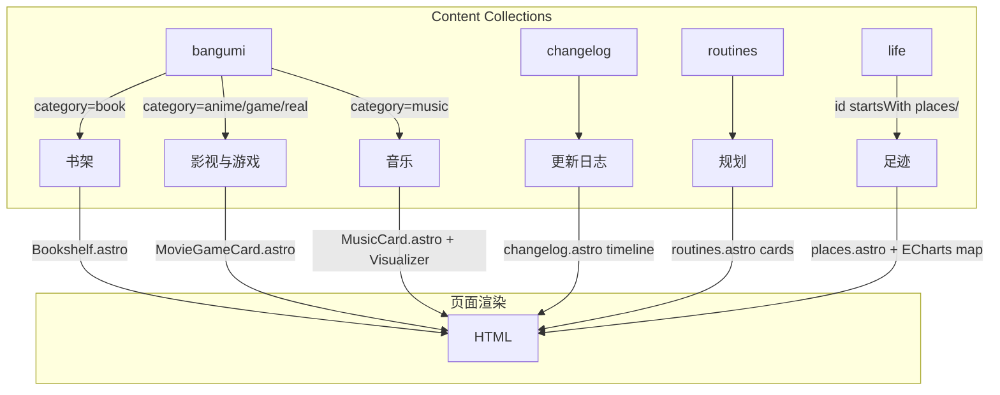

# "记录"功能模块完整分析

> 本文档分析 Firefly 博客中"记录"导航模块的完整实现，涵盖数据流、页面组件、路由、内容结构及共享基础设施。

---

## 1. 导航入口

"记录"是导航栏中的一个下拉菜单，定义在 [`src/config/navBarConfig.ts`](src/config/navBarConfig.ts)（第 75-114 行）。

```
┌─ 记录 ─────────────────────────────┐
│  ├─ 书架       → /books/           │
│  ├─ 影视与游戏 → /movies-games/    │
│  ├─ 音乐       → /music/           │
│  ├─ 更新日志   → /changelog/       │
│  ├─ 规划       → /life/routines/   │
│  └─ 足迹       → /life/places/     │
└────────────────────────────────────┘
```

前 4 个子项通过 `LinkPreset` 枚举（[`src/types/config.ts`](src/types/config.ts) 第 206-219 行）映射到实际 URL，映射表在 [`src/constants/link-presets.ts`](src/constants/link-presets.ts)。

书架、影视与游戏、音乐、更新日志这 4 项受 `siteConfig.pages` 开关控制（[`src/config/siteConfig.ts`](src/config/siteConfig.ts) 第 161-176 行），关闭后页面返回 404。规划与足迹则是固定显示的子项。

```typescript
// src/config/siteConfig.ts — 页面开关
pages: {
  sponsor: true,
  guestbook: true,
  bangumi: false,     // 原番组计划页面（已拆分）
  books: true,        // 书架
  moviesGames: true,  // 影视与游戏
  musicPage: true,    // 音乐
  changelog: true,    // 更新日志
},
```

---

## 2. 数据流概览

所有"记录"子项的数据都来自 **Astro Content Collections**，定义在 [`src/content.config.ts`](src/content.config.ts)：



| 子项 | Content Collection | 数据源目录 | 关键字段 |
|------|-------------------|-----------|---------|
| 书架 | `bangumi`（筛选 `category === "book"`） | `src/content/bangumi/book/` | title, image, status, score |
| 影视与游戏 | `bangumi`（筛选 `category !== "book"` 且 `!== "music"`） | `src/content/bangumi/{anime,game,real}/` | title, image, status, score, subcategory |
| 音乐 | `bangumi`（筛选 `category === "music"`） | `src/content/bangumi/music/` | title, artist, audioUrl, lrcUrl, metingId |
| 更新日志 | `changelog` | `src/content/changelog/` | version, date, type, description |
| 规划 | `routines` | `src/content/life/routines/` | name, time, icon, description, updatedAt |
| 足迹 | `life`（筛选 `id.startsWith("places/")`） | `src/content/life/places/` | province, city, experience, visitCount, date |

---

## 3. 页面与组件映射

### 3.1 书架 — `/books/`

| 文件 | 角色 |
|------|------|
| [`src/pages/books/index.astro`](src/pages/books/index.astro) | 书架列表页，从 `bangumi` 集合筛选 `category === "book"`，传给 Bookshelf 组件 |
| [`src/pages/books/[...slug].astro`](src/pages/books/[...slug].astro) | 书籍详情页（动态路由） |
| [`src/components/pages/books/Bookshelf.astro`](src/components/pages/books/Bookshelf.astro) | 书架网格布局组件 |
| [`src/components/pages/books/BookCard.astro`](src/components/pages/books/BookCard.astro) | 单本书籍卡片（封面、标题、评分、阅读状态） |

数据流程：

```
bangumi collection → filter category=book → sort by published desc
  → Bookshelf.astro → BookCard.astro 网格展示
```

### 3.2 影视与游戏 — `/movies-games/`

| 文件 | 角色 |
|------|------|
| [`src/pages/movies-games/index.astro`](src/pages/movies-games/index.astro) | 列表页，从 `bangumi` 集合筛选非 book/music 内容，支持分页 |
| [`src/components/pages/movies-games/MovieGameCard.astro`](src/components/pages/movies-games/MovieGameCard.astro) | 影视/游戏卡片组件 |
| [`src/components/pages/bangumi/FilterControls.astro`](src/components/pages/bangumi/FilterControls.astro) | 类型与状态筛选控件 |
| [`src/components/pages/bangumi/TabNav.astro`](src/components/pages/bangumi/TabNav.astro) | 选项卡导航（影视/游戏/纪录片/全部） |

### 3.3 音乐 — `/music/`

| 文件 | 角色 |
|------|------|
| [`src/pages/music/index.astro`](src/pages/music/index.astro) | 3D 音乐可视化页面，含播放器 |
| [`src/components/pages/music/MusicCard.astro`](src/components/pages/music/MusicCard.astro) | 音乐卡片组件（专辑封面、艺术家、播放按钮） |
| [`src/components/features/music-visualizer/MusicVisualizer.svelte`](src/components/features/music-visualizer/MusicVisualizer.svelte) | 3D 音乐可视化 Svelte 组件（`client:visible` 懒加载） |

音乐页面使用独立的 `Layout.astro`（而非 `MainGridLayout`），因为需要全屏 3D 体验。

### 3.4 更新日志 — `/changelog/`

| 文件 | 角色 |
|------|------|
| [`src/pages/changelog.astro`](src/pages/changelog.astro) | 时间线风格更新日志页面 |

支持按类型筛选：全部、`feature`（新功能）、`improvement`（优化）、`fix`（修复）、`removal`（移除）。筛选通过客户端 JS 实现，数据在构建时完全生成。

### 3.5 规划 — `/life/routines/`

| 文件 | 角色 |
|------|------|
| [`src/pages/life/routines.astro`](src/pages/life/routines.astro) | 日常规划页面，完全服务端渲染 |
| 数据源 | `src/content/life/routines/*.md` |

页面特点：
- 从 `routines` content collection 获取数据
- 通过 `render()` 函数将 Markdown 内容渲染为 HTML（零客户端 JS）
- 卡片形式展示每项规划，包含图标、标题、时间戳和正文
- 按 `updatedAt` 降序排列
- 带有统计胶囊（总项数、最后更新时间）

**示例数据** [`src/content/life/routines/每日时间规划表.md`](src/content/life/routines/每日时间规划表.md)：

```yaml
---
name: 每日时间规划表
time: 全天
icon: ✊️
color: "#22c55e"
description: 2026年10月1日之前
updatedAt: 2026-04-26
---
| 时间段 | 安排 |
|--------|------|
| 7:30   | 准时起床... |
```

### 3.6 足迹 — `/life/places/`

| 文件 | 角色 |
|------|------|
| [`src/pages/life/places.astro`](src/pages/life/places.astro) | 足迹页面，含 ECharts 中国地图可视化 + 地点列表 |
| 数据源 | `src/content/life/places/*.md` |

页面特点：
- **ECharts 中国地图**：动态加载 `echarts@5.4.3` + `china.json` 地图数据
- 省份着色按到访次数分段（深色表示到访多）
- 鼠标悬浮显示城市级详细数据
- **暗色模式适配**：监听 `class` 变更，自动重绘地图
- **SPA 兼容**：监听 `astro:after-swap` 和 `swup:contentReplaced` 事件
- 统计胶囊（地点数、到访次数、今年出行）
- 地点列表卡片（省份、城市、体验描述、到访次数）

**示例数据** [`src/content/life/places/2026-04-17.md`](src/content/life/places/2026-04-17.md)：

```yaml
---
date: 2026-01-30
province: 河南
city: 商丘
experience: 去睢县和宝宝见面了，玩的非常开心
visitCount: 99
---
```

---

## 4. 完整路由表

所有"记录"相关路由：

| 路由 | 文件路径 |
|------|---------|
| `/books/` | `src/pages/books/index.astro` |
| `/books/[slug]/` | `src/pages/books/[...slug].astro` |
| `/movies-games/` | `src/pages/movies-games/index.astro` |
| `/music/` | `src/pages/music/index.astro` |
| `/changelog/` | `src/pages/changelog.astro` |
| `/life/routines/` | `src/pages/life/routines.astro` |
| `/life/places/` | `src/pages/life/places.astro` |

---

## 5. 共享基础设施

| 基础设施 | 说明 |
|----------|------|
| **布局** | 除音乐页外，所有"记录"页面使用 `MainGridLayout` |
| **国际化** | 所有标题/描述通过 `I18nKey` 枚举 + `i18n()` 函数实现多语言 |
| **页面开关守卫** | 每个受开关控制的页面顶部有 `if (!siteConfig.pages.xxx) return Astro.redirect("/404/")` |
| **Navbar 动态生成** | `navBarConfig.ts` 根据 `siteConfig.pages` 动态构建导航链接 |

---

## 6. 关键技术点

### 6.1 bangumi 集合复用

书架、影视与游戏、音乐三个看似独立的模块，实际**共享同一个 `bangumi` content collection**，仅在页面层通过 `category` 字段过滤：

```typescript
// 书架
const bookItems = customBangumi.filter((item) => item.data.category === "book");

// 音乐
const musicEntries = customBangumi.filter((item) => item.data.category === "music");
```

这意味着在 `src/content/bangumi/` 下添加一个文件，会自动出现在对应页面中。`bangumi` 集合的 schema（[`src/content.config.ts`](src/content.config.ts) 第 57-84 行）同时支持书籍、影视、游戏、音乐四种类型，通过 `category` 字段区分。

### 6.2 足迹地图客户端渲染

`places.astro` 使用 `<script is:inline>` 内联脚本 + ECharts 动态加载，包含完整的生命周期管理：

- **延迟加载**：页面完全加载后 `requestAnimationFrame` 初始化
- **CDN 回退**：本地 `/china-map.json` 加载失败时回退到 jsdelivr CDN
- **暗色模式**：监听 `document.documentElement` 的 `class` 变更，销毁并重建图表
- **SPA 导航**：同时监听 `astro:after-swap` 和 `swup:contentReplaced` 事件

### 6.3 规划页完全服务端渲染

`routines.astro` 在构建时通过 `render()` 函数将 Markdown 内容渲染为 HTML，无需客户端 JavaScript，性能最优。

### 6.4 音乐页独立布局

音乐页面使用独立的 `Layout.astro`（而非 `MainGridLayout`），因为 3D 可视化需要全屏体验。这是"记录"中唯一使用 Svelte 交互组件的页面（`MusicVisualizer.svelte`）。

---

## 7. 配置文件索引

| 文件 | 作用 |
|------|------|
| [`src/config/navBarConfig.ts`](src/config/navBarConfig.ts) | 导航栏菜单结构定义 |
| [`src/config/siteConfig.ts`](src/config/siteConfig.ts) | 页面开关配置 |
| [`src/constants/link-presets.ts`](src/constants/link-presets.ts) | LinkPreset 枚举到 URL 的映射 |
| [`src/types/config.ts`](src/types/config.ts) | LinkPreset 枚举定义 |
| [`src/content.config.ts`](src/content.config.ts) | 所有 Content Collection 的 loader + schema |
| [`src/i18n/`](src/i18n/) | 5 种语言的翻译文件 |